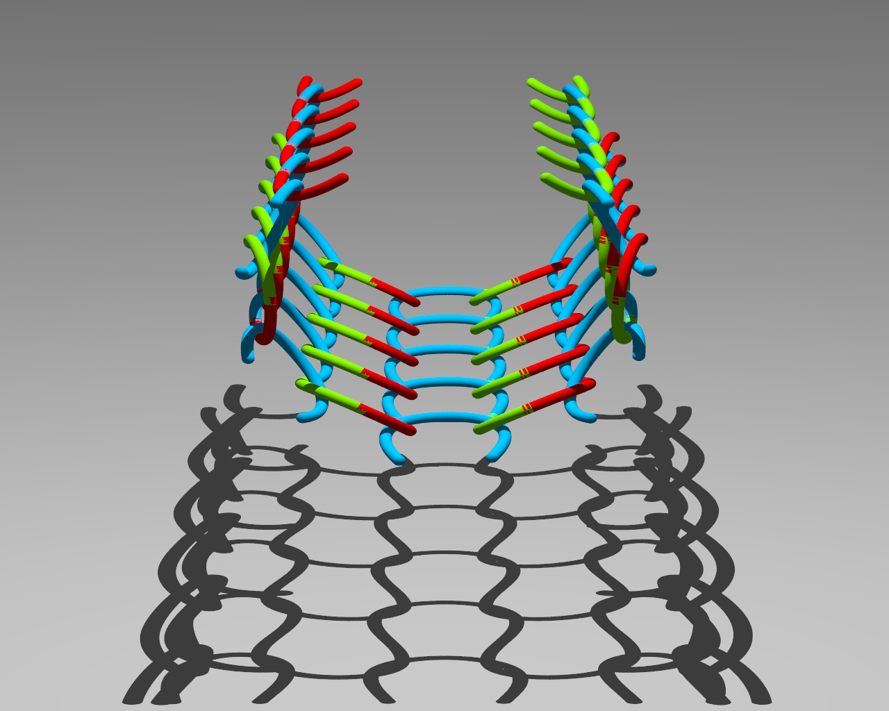
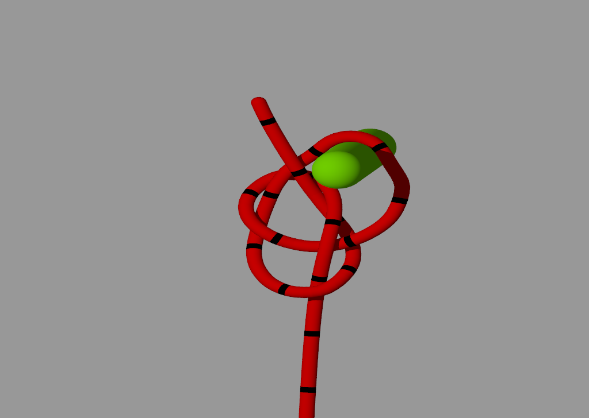
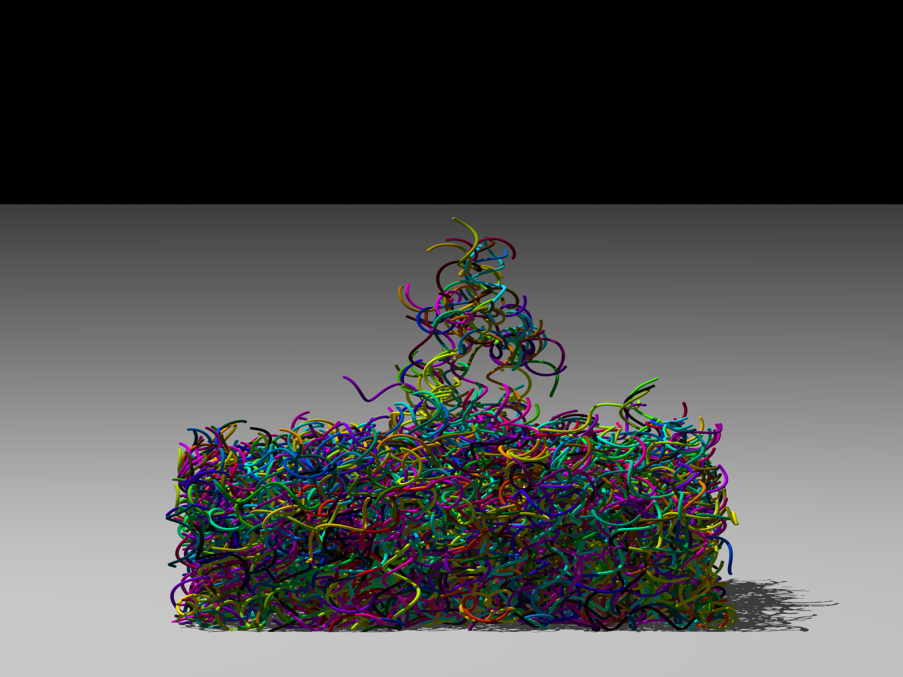
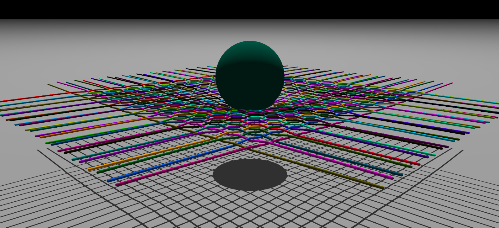
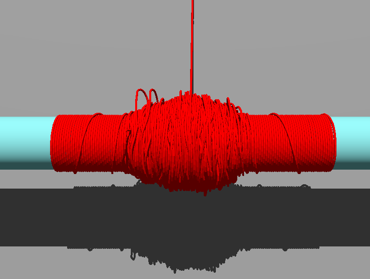
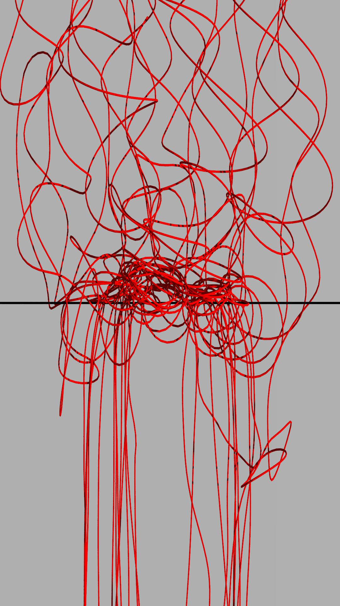
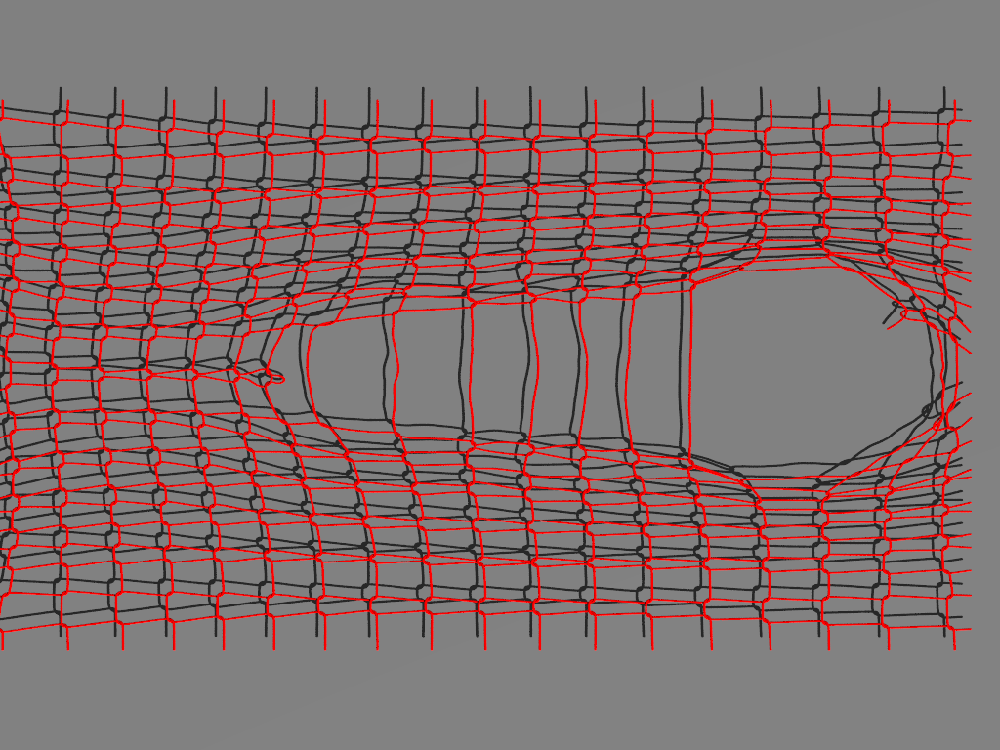

# FrictionalFibers — Documentation (Fiber_v9.6)

**Jérôme Crassous**  
Univ Rennes, CNRS, IPR (Institut de Physique de Rennes) – UMR 6251, F-35000 Rennes, France  
PMMH, CNRS, ESPCI Paris, Université PSL, Sorbonne Université, Université de Paris, 75005 Paris, France  
jerome.crassous@univ-rennes1.fr — [https://jerome-crassous.github.io/](https://jerome-crassous.github.io/)

> *This documentation was written with the help of an artificial intelligence (Claude, Anthropic), based on the source code and the reference article.*

<table align="center">
  <tr>
    <td align="center"><br><sub>Curved knitted fabric</sub></td>
    <td align="center"><br><sub>Bowline knot</sub></td>
    <td align="center"><br><sub>Assembly of helical fibers</sub></td>
  </tr>
  <tr>
    <td align="center"><br><sub>Woven net impacted by a sphere</sub></td>
    <td align="center"><br><sub>Winding on a spool</sub></td>
    <td align="center"><br><sub>Entangled fibers (hair)</sub></td>
  </tr>
  <tr>
    <td align="center" colspan="3"><br><sub>Laddering in a knitted fabric</sub></td>
  </tr>
</table>

Discrete element method (DEM) simulation of elastic rods (fibers) in frictional contact, on GPU (OpenCL). The mechanical model and its validation are published in:

> J. Crassous, *Discrete-element-method model for frictional fibers*, Phys. Rev. E **107**, 025003 (2023). DOI: 10.1103/PhysRevE.107.025003

This code has been used in the following studies:

- A. Faulconnier, L. Michel, M. Adda-Bedia, J. Crassous, A. Steinberger, [*Laddering of a knitted fabric: a topology-induced failure*](https://arxiv.org/abs/2604.20580), arXiv:2604.20580 (2026).
- J. Sabater, J.-S. Park, J. Crassous, S. Neukirch, P. M. Reis, [*Frictional sliding strength of knotted and capstan configurations along the axis of a cylinder*](https://www.sciencedirect.com/science/article/pii/S0022509626001286), J. Mech. Phys. Solids **213**, 106628 (2026).
- B. F. G. Aymon, F. Derveni, M. Gomez, J. Crassous, P. M. Reis, [*Self-locking and stability of the bowline knot*](https://www.sciencedirect.com/science/article/pii/S2352431625001257), Extreme Mech. Lett. **81**, 102413 (2025).
- J. Crassous, S. Poincloux, A. Steinberger, [*Metastability of a periodic network of threads: shapes of a knitted fabric*](https://journals.aps.org/prl/abstract/10.1103/PhysRevLett.133.248201), Phys. Rev. Lett. **133**, 248201 (2024).
- A. Seguin, J. Crassous, [*Twist-controlled force amplification and spinning tension transition in yarn*](https://journals.aps.org/prl/abstract/10.1103/PhysRevLett.128.078002), Phys. Rev. Lett. **128**, 078002 (2022).

This documentation does not re-derive the model in detail (see Part III and the article above); it explains how to **use** the program (Part I), how it is **implemented in parallel** (Part II), and summarizes in an appendix the underlying **physical model** (Part III).

## Contents

- [Part I — User guide](#part-i--user-guide)
- [Part II — Algorithm and kernels](#part-ii--algorithm-and-kernels)
- [Part III — Appendix: physical model](#part-iii--appendix-physical-model)

---

# Part I — User guide

This part is intended for anyone who wants to **use** the program on their own case, building on the provided examples, without necessarily understanding the details of the GPU kernels.

## I.1 Overview

The program simulates a set of discrete elastic fibers (chains of cylindrical segments) subjected to internal forces (stretching, bending, twisting) and to frictional contact forces between them. The core of the computation (forces, contacts, time integration) runs on the GPU through OpenCL kernels; the CPU ("host") only prepares the initial geometry, drives the loop, and periodically reads back the state to save it.

Each **case study** (a particular geometry: clamped beam, helix, fabric, tennis net, etc.) is a small self-contained C project that reuses a common library (`Librairie_v9.6`) and a common set of kernels, and only provides:

- the initial geometry and parameters (host functions `SetFibersParameters` / `SetFibersInitialPositions`),
- three "specific" kernels (`kernel_specific.cl`) that apply the external forces and geometric constraints of the case under study (clamping, imposed traction, imposed twist, etc.).

Everything else (elastic force computation, contact detection and handling, Verlet integration, transport of the material frame) is **generic** and shared by all examples.

## I.2 Source file organization

```
sources/
├── fiberLib_Common_Macros_v9.6.h      # shared constants/macros (WG, statuses, ...)
├── fiberLib_OpenCL_v9.6.h             # host structures (fiber, parameter, contact) + prototypes
├── functions_v9.6.cl                  # small OpenCL utility functions (rotation, parallel transport, ...)
├── kernel_le_force_v9.6.cl            # elastic forces: lengths/e_i, stretching, bending, twisting
├── kernel_poss_contact_v9.6.cl        # detection of potential contacts (broad-phase)
├── kernel_contact_v9.6.cl             # contact geometry + contact forces (narrow-phase)
├── kernel_integrate_shift_v9.6.cl     # Verlet integration + transport of the material frame
├── kernel_max_v9.6.cl                 # reductions (max displacement, contact count, dissipation, ...)
│
├── Librairie_v9.6/                    # host (C) library shared by all examples
│   ├── fiber.c                        # allocation of a fiber (AllocateOneFiberLib)
│   ├── geometry.c                     # initial material frame, curvature, lengths (host)
│   ├── energy.c                       # energies (host, for diagnostics/plots)
│   ├── math.c                         # 3D vector algebra, rotations, RNG
│   ├── read_save_config.c             # saving/reading configurations (config.dat, reduced_Config.tmp)
│   ├── device_init.c                  # OpenCL initialization, kernel compilation, Execute_Kernel_*
│   ├── device_host_device.c           # buffer allocation, host <-> device transfers
│   ├── device_err_code.c, times.c, print.c
│
├── Visu_v9.6/                         # small OpenGL/GLUT viewer + POV-Ray export
│
└── Fiber_v9.6_<CaseName>/              # one folder per case study, e.g. SimpleBending, Twist, Coil, ...
    ├── main.c / main.h                # entry point, default global parameters
    ├── core.c                         # DoOneIteration(): orchestrates the kernels at each time step
    ├── <case_name>.c                  # SetFibersParameters() + SetFibersInitialPositions() (specific)
    └── kernel_specific.cl             # kernel_Specific_OneTime / _Force / _Position (specific)
```

The examples provided in this repository are: `SimpleBending` (bending of a clamped beam), `Twist` (torsional buckling of a rod), `Coil` (single fiber wound into a helix), `Multiple_coils` (assembly of helical fibers, strand/yarn-like), `Jersey` (knitting, jersey stitches on a grid), and `Tennis_v2_square` (woven net, tennis-racket-like).

## I.3 Compilation and requirements

The code is written in C, targets Windows (`windows.h`, `omp.h`) and uses the **OpenCL** API (`CL/cl.h`) to drive the GPU. Each case study is an independent executable that must be compiled with:

- access to the OpenCL SDK (headers + library from your GPU vendor, or a generic ICD),
- the `Librairie_v9.6` files compiled/linked into the project,
- execution **from the case-study folder**: `Create_Kernels()` loads the `.cl` sources by relative path (`"..\functions_v9.6.cl"`, `"kernel_specific.cl"`, etc.), so the current working directory must be that folder.

At run time, the program picks an OpenCL platform (it prefers a platform whose name starts with "NV", otherwise the first one found), creates a context and a command queue, then compiles all the `.cl` files into a single program.

## I.4 Discretization of an elastic rod: basic notions

A fiber is represented by a **chain of N nodes** $r_0, \dots, r_{N-1}$ connected by **N−1 straight cylindrical segments** (segment $i$ connects $r_i$ to $r_{i+1}$). This is the "discrete elastic rods" discretization (Bergou et al.), taken up and adapted to frictional contact by the reference article.

For each segment $i$ we define:

- the **unit tangent vector** $e^i = (r_{i+1}-r_i)/\lVert r_{i+1}-r_i\rVert$,
- the **current length** $l^i = \lVert r_{i+1}-r_i\rVert$, expected to stay close to the rest length $l_0$ (the bending/twisting computation assumes $l^i \simeq l_0$, actual stretching being handled separately by a longitudinal spring),
- two **unit material vectors** $m^i_{(1)}, m^i_{(2)}$ such that $(e^i, m^i_{(1)}, m^i_{(2)})$ forms a right-handed frame. They carry the "twist" orientation of the segment (like the material frames of a Kirchhoff rod).
- a **twist angle** $\theta_i$: $m^i_{(1)}$ is obtained by rotating a twist-free reference vector $\bar m^i_{(1)}$ ("m1_bar") by an angle $\theta_i$ around $e^i$. $\bar m^i_{(1)}$ is updated at each time step by **parallel transport** (without added twist) along the curve: this is what allows curvature (bending) to be cleanly separated from twist.

The full kinematic state of a fiber at a given time is therefore entirely described by:

- the node positions $r_i$, $0 \le i \le N-1$,
- the twist angles $\theta_i$, $0 \le i \le N-2$ (one angle per segment).

Each node/segment also carries a **natural curvature** ("at rest") $\bar\kappa_{(1),i}, \bar\kappa_{(2),i}$: this is the curvature the fiber would spontaneously have without external constraint — zero for a straight fiber, non-zero to model a naturally curled/crimped fiber. It is a field (`kappa1_bar[i]`, `kappa2_bar[i]`) provided by the user segment by segment.

Finally, each **fiber** (not each segment) carries uniform material properties: radius `radius`, segment rest length `l0`, stretching stiffness `k0`, mass per node `masse`, twisting moment of inertia `j`, bending modulus `bending` ($B$) and twisting modulus `c` ($C$).

## I.5 User-side data structures

Two C structures (defined in `fiberLib_OpenCL_v9.6.h`) are handled on the host side to describe a simulation.

### The `fiber` structure (one per fiber)

| Field | Role |
|---|---|
| `n` | number of nodes N of the fiber (hence N−1 segments) |
| `status` | `STATUS_FREE` (dynamic fiber), `STATUS_FIXED` (immobile), `STATUS_VIRTUAL` ("padding" fiber, see I.7) |
| `radius`, `l0`, `k0`, `masse`, `j` | cylinder radius, segment rest length, stretching stiffness, mass per node, moment of inertia |
| `bending` ($B$), `c` ($C$) | bending modulus and twisting modulus |
| `xt[i][3]`, `xtm[i][3]` | position of node $i$ at time $t$ and at the previous time $t-\Delta t$ (needed by the Verlet integrator) |
| `thetat[i][3]`, `thetatm[i][3]` | only component `[2]` (the $e^i$ axis, stored as the local "z" component) is used: it is $\theta_i$ at $t$ and $t-\Delta t$ |
| `e[i][3]` | tangent vector $e^i$ of segment $i$ (computed, not to be provided) |
| `m1_bar[i][3]`, `m1[i][3]` | reference material frame (transported without twist) and actual material frame |
| `kappa1_bar[i]`, `kappa2_bar[i]` | natural curvature of segment $i$ |
| `f[i][3]`, `moment[i][3]` | force and moment accumulated on the node/segment (computed by the kernels) |
| `flag[i]` | free integer, usable by the specific kernel to tag certain nodes (e.g. fabric edges) |

### The `parameter` structure (global simulation parameters)

The most commonly used fields:

| Field | Role |
|---|---|
| `dt` | time step $\Delta t$ |
| `kn`, `kt` | normal and tangential contact stiffnesses |
| `lambda` | global (transverse) viscous damping, $f^{visc} = -\lambda \dot r$ |
| `lambda_internal` | viscous damping of stretching (longitudinal) |
| `lambda_contact_n`, `lambda_contact_t` | viscous contact damping (normal/tangential) |
| `mu` | Coulomb friction coefficient |
| `nFiber`, `nSegment` | number of fibers, total number of segments (computed) |
| `nContactMax` | size of the contact list (must be a multiple of `WG`, see Part II) |
| `epsStar` | distance threshold for potential-contact search (self-adjusted, see II.5) |
| `periodic` | `PERIODIC_NO`, `PERIODIC_XY`, ... periodic boundary conditions |
| `bending`, `c` | default values of $B$ and $C$ (often copied into each `fiber`) |
| `iter`, `iterStop` | iteration counter and stopping iteration |
| `lx, ly, lz`, `R`, `RHelix`, `pitch`, ... | free geometric parameters, used as each case study sees fit (periodic box, radius of a winding cylinder, helix pitch, etc.) |

Useful constants are in `fiberLib_Common_Macros_v9.6.h`, in particular:

- `WG = 1024`: work-group size used by most 1D kernels (see Part II),
- `STATUS_FREE=0`, `STATUS_FIXED=1`, `STATUS_VIRTUAL=2`,
- `NOCONTACT`, `OLDCONTACT`, `STILLCONTACT`, `NEWCONTACT`: contact states.

## I.6 Life cycle of a simulation (`main.c`)

The `main()` of a case study always does, in order:

1. Allocate `gParameterPtr` and set the default parameters (dt, kn, kt, lambda, bending, mu, nContactMax, ...).
2. Allocate `gFiber` (array of `fiber`) and `gContact`.
3. Call the two **case-specific** functions:
   - `SetFibersParameters()`: allocates each fiber (`AllocateOneFiberLib`) and sets its material properties;
   - `SetFibersInitialPositions()`: sets the initial geometry $r_i$, $\theta_i$, $\bar\kappa_{(1,2),i}$, and initializes the material frame via `Calculate_Relaxed_M1_Bar` then `Calculate_M1_From_M1Bar_And_Theta`.
4. Initialize the device: `InitDevice()`, `Create_Device_Ptrs()`, `Create_Host_Ptrs()`, `Create_Kernels()` (compiles the `.cl` files and sets the arguments of each kernel once and for all).
5. Copy the initial state host → device (`Copy_Utils_host2dev`, `Copy_Fiber_host2dev`, `Copy_Param_host2dev`).
6. Loop indefinitely on `DoOneIteration()` (defined in the case study's `core.c`, whose skeleton is identical from one example to another — see Part II.3), which periodically brings the state back to the host (`Copy_Fiber_dev2host`) to write it to disk (`SaveReducedConfigLib`) and print a diagnostic (e.g. bending energy).

## I.7 Writing your own geometry: the 4 functions to provide

To create a new case study, you must provide:

**1) `SetFibersParameters(void)`** — allocates each real fiber with `AllocateOneFiberLib(gFiber, iFiber, n)` and sets `status`, `radius`, `l0`, `k0`, `masse`, `bending`, `c`, `j`.

**2) `SetFibersInitialPositions(void)`** — sets `xt[i]`, `thetat[i][2]`, `kappa1_bar[i]`, `kappa2_bar[i]`, initializes `m1_bar[0]` with a vector not parallel to $e^0$, then calls `Calculate_Relaxed_M1_Bar` (propagates the twist-free frame along the fiber by Darboux transport) and `Calculate_M1_From_M1Bar_And_Theta` (applies the $\theta_i$ rotation). Ends by copying `xt → xtm` and `thetat → thetatm` ("at rest" state, zero initial velocity for the Verlet integrator).

**Virtual fiber.** The 1D kernels run with a fixed work-group size `WG=1024`; the total number of segments must therefore be a multiple of `WG`. All examples consequently add, after the "real" fibers, a last fiber with status `STATUS_VIRTUAL` whose only purpose is to pad `nSegment` up to the next multiple of `WG`:

```c
missingSegment = ((gParameterPtr->nSegment + WG - 1) / WG) * WG - gParameterPtr->nSegment;
iFiber = gParameterPtr->nFiber - 1;
AllocateOneFiberLib(gFiber, iFiber, missingSegment);
gFiber[iFiber].status = STATUS_VIRTUAL;
```
Virtual segments are ignored by the force and contact kernels (tests `if (status[iFiber]==STATUS_VIRTUAL) return;`).

**3) Three "specific" kernels in `kernel_specific.cl`** — this is the main extension point, called at every iteration:

- `kernel_Specific_OneTime(param_Uint, param_Double)`: executed **only once** per iteration (grid size = 1), useful to update a counter or a global parameter (e.g. increment `param_Uint[0]`, make a target force evolve in time).
- `kernel_Specific_Force(...)`: executed **once per segment**, after the elastic forces are computed; it adds the **external forces** specific to the case under study (traction imposed at the fiber end, gravity, etc.). In the `SimpleBending` example:
  ```c
  __kernel void kernel_Specific_Force(...) {
      iSegment = (uint)(get_global_id(0));
      iFiber = iFiberFromSegment[iSegment];
      i = iFromSegment[iSegment];
      if ((iFiber == 0) && (i + 1 == n[iFiber]))
          f[3 * iSegment + 2] -= 1.e-4;   // point force at the end of fiber 0
  }
  ```
- `kernel_Specific_Position(...)`: executed **once per segment**, after time integration; it imposes the **geometric constraints** (clamping, imposed displacement or twist) by overwriting `xt`/`thetat` with a prescribed value. In `SimpleBending`, the first two nodes of the fiber are reset to their previous position, which implements the clamping:
  ```c
  if ((iFiber == 0) && (i <= 1)) {
      for (k = 0; k < 3; k++) {
          xt[3*iSegment+k] = xtm[3*iSegment+k];
          thetat[3*iSegment+k] = thetatm[3*iSegment+k];
      }
  }
  ```
  The file `functions_v9.6.cl` provides a utility function `FastCheck(fiber1,i1,fiber2,i2)` that can be redefined in `kernel_specific.cl` to exclude *a priori* some fiber/node pairs from contact detection (return `SKIP_CONTACT_DETECTION`), which avoids testing contacts that cannot occur and speeds up the simulation.

**4) `main.c`/`main.h`** — copied from an existing example and adapted: number of fibers, `nContactMax`, default values of `dt`, `kn`, `kt`, `bending`, `mu`, etc.

## I.8 Minimal annotated example: `SimpleBending`

This is the simplest example: static bending of a clamped beam under a point force at its tip, comparable to the first validation test of the article (deflection of a clamped rod, Fig. 5).

**Parameters** (`main.c`): `nFiber = 2` (one real fiber + one virtual fiber), `ls = 1.5` (segment length $l_0$), `bending = 0.1` ($B$), `nContactMax = 32·WG`, `dt = 0.1`, `kn = 1`, `kt = 0.5`, `lambda_internal = 2.8`, `mu = 0.5`.

**Geometry** (`simple_bending.c`): one fiber of 20 segments, aligned with the $x$ axis:
```c
AllocateOneFiberLib(gFiber, iFiber, 20);
gFiber[iFiber].status = STATUS_FREE;
gFiber[iFiber].l0 = gParameterPtr->ls;
...
gFiber[iFiber].xt[i][0] = ((double)i) * gFiber[iFiber].l0;   // straight line along x
gFiber[iFiber].thetat[i][1] = 0.;                            // no twist
gFiber[iFiber].kappa1_bar[i] = 0.;                           // no natural curvature
```

**Specific kernels** (`kernel_specific.cl`, see I.7): a force `f_z -= 1e-4` is permanently applied to the last node of the fiber, and the first two nodes are frozen at their previous position at every time step — which implements the clamping.

**Flow** (`core.c`, function `DoOneIteration`): at each iteration, elastic forces → specific force → contact detection/computation (no effect here, the fiber does not touch itself) → integration → specific geometric constraint → measurement of the max displacement. Every `10 000` iterations, the state is brought back to the host, saved, and the height of the beam tip as well as the bending energy are printed:
```c
printf("iter = %u h = %e enrgy = %e\n", iter, gFiber[0].xt[gFiber[0].n-1][2], eBending);
```
When `iter == iterStop`, the final beam profile is written to `profile.txt` (columns $x_i, z_i$) and the program stops.

This is the skeleton to reproduce for any new case: only the initial geometry and the content of the three specific kernels change.

## I.9 Tour of the other provided examples

- **`Twist`** — a single fiber aligned along $-z$, with an initial material frame `m1_bar[0] = (0,1,0)`. Used to study torsional buckling of a rod compressed/twisted at its ends (comparable to the buckling test of the article, Fig. 6): the end constraints (imposed torque, transverse blocking) are implemented in `kernel_specific.cl` (not detailed here, to be adapted to the target torque).

- **`Coil`** — a single fiber initially placed on a **parametric helix**:
  ```c
  x = RHelix*sin(t);  y = RHelix*cos(t);  z = pitch*t;
  ```
  (function `S2PositionHelix`, parameters `gParameterPtr->RHelix`, `gParameterPtr->pitch`), the nodes being placed at constant arc length $l_0$ along this curve. The natural curvature `kappa1_bar`/`kappa2_bar` is computed node by node from the variation of $e^i$ along the helix, so that the helix is an **at-rest** (unstressed) configuration of the fiber — typically to study an already coiled strand/spring.

- **`Multiple_coils`** — same geometric principle as `Coil`, but applied to *several* fibers (`SetOneFiberInitialPositions` called for each fiber), each randomly shifted (`shift` drawn with `MyRand()`) in an `lx × ly × lz` box: useful to study a bundle of fibers/springs in frictional interaction.

- **`Jersey`** — models a **knitted stitch** (jersey): the shape of a knitting loop is read from an external point file (`x_theta_lw70_lc70.txt`), resampled (`loop_raw` → `loop`, linear interpolation), then reproduced fiber by fiber on a `GN_CELL_X × GN_CELL_Y` grid of cells (horizontal through-fibers, lower/upper fibers, corners), with special handling of the edge fibers. This is the example closest to a complex "industrial" geometry built by assembling blocks.

- **`Tennis_v2_square`** — a crossed net (like racket strings): half of the fibers follow a cosine `S2Position` (`amp*cos(2π t /(2L))`) and are then symmetrized and repeated with alternating sign (`pow(-1, iFiber-nHalfHalf)`) to create a weave, the other half being straight and perpendicular. An additional file `test_energy.c` allows numerical checking of the energies computed by the kernels against the host formulas (`BendingEnergyLib`, etc.).

In all cases, compare the `<name>.c` file of the case you are interested in with that of `SimpleBending`: the structure is identical (allocation, positions, `m1_bar`, setting at rest), only the geometric formula changes.

## I.10 Outputs, saving and visualization

Two save formats are provided by `read_save_config.c`:

- **Full configuration** (`SaveConfigLib` / `ReadConfigLib`, file `config.dat` or `config_<line>_<n>.tmp`): all `fiber` fields in double precision — allows a simulation to be resumed exactly.
- **Reduced configuration** (`SaveReducedConfigLib` / `ReadReducedConfigLib`, file `reduced_Config.tmp` or `reduced_Config_<line>_<n>.tmp`): only `xt`, `e`, `thetat`, `m1` in single precision — this is the format that `core.c` writes periodically during the simulation, and that the viewer reads.

The **`Visu_v9.6`** folder is a small separate OpenGL/GLUT program that reads back the `reduced_Config_<line>_<n>.tmp` files produced by a simulation and displays them as a "movie": at startup it reads a `movie.txt` file containing, in order, the data path, the `line` number, the start index, the step between two frames and a delay, then advances automatically (`glutIdleFunc(DoOneIteration)`). It can also export each frame as a **POV-Ray** scene (`povray.c`) for offline photo-realistic rendering, with a random color set per fiber (`SetColors`).

For a quick diagnostic without the viewer, `PrintReducedConfigLib` writes a readable text file `check_Reduced_Config.txt` (one line per node: position, $e$, $\theta$, $m_1$), and the functions in `energy.c` (`BendingEnergyLib`, `TwistEnergyLib`, `TractionEnergyLib`, `KineticEnergyLib`) make it possible to follow the evolution of the various energies over time from `core.c`.

## I.11 Practical advice on choosing parameters

The model is usually used in **dimensionless** units (see Part III.5 for the full physical justification). A few practical guidelines, consistent with the values used in the examples and in the article:

- Time step $\Delta t^* \approx 0.1$ as long as $k_n^* \sim 1$ (otherwise $\Delta t^* \sim 0.1\, \min(1, (k_n^*)^{-1/2})$).
- Contact stiffnesses $k_n^* = k_t^* \sim 1$.
- Internal damping $\lambda_{internal}^* \sim 1$–$3$ to quickly suppress spurious compression waves along the segments (the examples use values between 1 and 2.8).
- Contact damping $\lambda_{n}^* \sim 1$.
- The global viscous damping $\lambda^*$ must remain small (often $10^{-3}$–$10^{-4}$): it only serves to stabilize transverse motion away from contacts, not to model actual physical dissipation.
- Always check that the typical dimensionless force remains small ($f^* \sim 10^{-5}$–$10^{-3}$) to stay within the small-elongation assumption used by the discrete bending/twisting computation — and check convergence by doubling `N` (the number of segments) and halving `dt`.
- `nContactMax` must be chosen large enough never to saturate (the program prints `maxPossibleContacts` at each rebuild of the potential-contact list, see II.5) and must remain a multiple of `WG`.

---

# Part II — Algorithm and kernels

This part details the parallel implementation: memory layout on the device, exact sequence of kernels executed at each iteration, and internal workings of the contact pipeline — the most specific part of this code, adapted to non-spherical objects (elongated cylinders) on GPU.

## II.1 General principle

All per-fiber, per-segment (node) and per-contact quantities are stored as a **structure of arrays** (SoA) on the device — one array per field (`fiber_xt_devPtr`, `fiber_e_devPtr`, `fiber_moment_devPtr`, ...) rather than an array of structures — for coalesced memory access in the kernels.

Each **global segment** is indexed by an integer `iSegment` (0 ≤ `iSegment` < `nSegment`), obtained by concatenating the segments of all fibers. Two utility arrays allow going back to the "fiber + local rank" identity:

```c
iFiber = iFiberFromSegment[iSegment];
i      = iFromSegment[iSegment];       // 0 <= i < n[iFiber]
```
(on the host side, the equivalent function is `NSegment(fiber*, parameter*, iFiber, i)`, which performs the inverse operation).

Two work-group size constants structure all kernels:

- `WG = 1024`: work-group size for 1D kernels (one thread per segment, or per contact).
- `WG2D = 32`: work-group size (32×32) for the 2D contact-detection kernel.

`NFPS = 128` is the maximum number of force/moment contributions a single segment can receive in one time step (accumulation through a list, see II.5), and `NPARAM = 100` is the size of the shared scalar parameter arrays `param_UInt`/`param_Double`.

## II.2 Device parameter table (`param_UInt` / `param_Double`)

Rather than passing each scalar individually to each kernel, two global arrays `param_UInt[NPARAM]` and `param_Double[NPARAM]` are copied to the device and read by all kernels at a fixed location ("slot"). `Copy_Param_host2dev` (in `device_host_device.c`) establishes the mapping:

**`param_UInt`** (excerpts):

| Slot | Content |
|---|---|
| 0 | `iter` (iteration counter) |
| 2 | `nFiber` |
| 3 | `nSegment` |
| 4 | `nContactMax` |
| 6 | `periodic` |
| 7 | number of actual contacts (written by `kernel_Count_Contact_Step2`) |
| 20–29 | free counters/iterations (`iter0`, `iter1`, `low_High_Eta`, `iter3`, `rRate`, `low_High_Mu`, `iter6..8`, `iterStop`) |
| 30–39 | free flags (`flag0..flag7`, `flag_Phase`), and **39 = `flag_Reset_Contact`** (forces a rebuild of the contact list) |

**`param_Double`** (excerpts):

| Slot | Content |
|---|---|
| 0 | `dt` |
| 1, 2 | `kn`, `kt` |
| 3, 4 | `lambda`, `lambda_internal` |
| 5, 6 | `lambda_contact_n`, `lambda_contact_t` |
| 7 | `mu` |
| 30 | `epsStar` (current contact-detection threshold, self-adjusted) |
| 31 | max displacement of the iteration (output of `kernel_Max_Displacement`) |
| 32 | displacement integrated since the last rebuild of the contact list (`Δ` of the II.5 algorithm) |
| 33–37 | dissipation accumulators (global viscous, stretching, normal/tangential contact, "W" operator) |
| 50–52 | `lx, ly, lz` (used by `ComputeShift` for periodic images) |

The free slots (40 and above for doubles, 30 and above for integers apart from those listed) are available to each case study for its own needs (target force, target angle, etc.), read in `kernel_Specific_*` via `param_Double[...]`/`param_UInt[...]`.

## II.3 The iteration loop

`DoOneIteration()` (whose skeleton is identical for all examples) chains, at each time step:

```c
Execute_Kernel_Calculate_le(p);          // e_i, l_i; viscous force + stretching
Execute_Kernel_Bending_Force(p);         // bending force + moment
Execute_Kernel_Twist_Force(p);           // twisting force + moment

Execute_Kernel_Specific_Force(p);        // [user] external forces

Execute_Kernel_PossibleContact(p);       // possible (re)build of the potential-contact list
Execute_Kernel_Contact(p);               // exact geometry of the potential contacts
Execute_Kernel_RemoveDoubleContact(p);   // duplicate removal
Execute_Kernel_CalculateContactForce(p); // normal + tangential forces (Cundall-Strack)
Execute_Kernel_AddContactForce(p);       // reduction of the per-segment contributions
Execute_Kernel_ShiftContact(p);          // aging of the contact states (t-dt <- t)

Execute_kernel_Integrate_and_Shift(p);   // Verlet: x(t+dt), theta(t+dt)

Execute_kernel_Compute_m1bar(p);         // parallel transport of the reference frame
Execute_kernel_Specific_Position(p);     // [user] geometric constraints
Execute_kernel_Compute_m1(p);            // applies theta to obtain the actual m1

Execute_Kernel_Max_Displacement(p);      // reduction: max displacement -> decides contact refresh
```
This skeleton corresponds very directly to the general algorithm of the reference article (internal forces → external forces → contacts → integration → transport → geometric constraint). No kernel requires any intervention from the user **except** the two marked `[user]`, which directly call `kernel_Specific_Force`/`kernel_Specific_Position` defined in the case study's `kernel_specific.cl` (see I.7).

## II.4 Details of the internal-force kernels

**`kernel_Calculate_le`** (one thread per segment) — computes $e^i$ and $l^i$ for each segment (at $t$ and $t-\Delta t$), resets the segment's force/moment and puts in it: the global viscous force $-\lambda(x_t - x_{tm})/\Delta t$, the longitudinal stretching force and damping (spring $k_0$ + damper $\lambda_{internal}$ between neighboring nodes), and accumulates the corresponding dissipations in `dissip_visc_global`/`dissip_visc_stretch` (used for an energy balance, cf. `Execute_Kernel_Dissipation`).

**`kernel_BendingForce`** (one thread per segment, called with `local_size = WG/4`) — implements the discretization of curvature and bending force given in Part III.2: for each segment $i$, a window of 5 nodes ($x_{i-2}\dots x_{i+2}$) and the neighboring $e$, $m_1$ are read, the discrete second derivative $d^2r/ds^2$ is computed at three consecutive positions ($i-1$, $i$, $i+1$), the reduced curvature $\kappa_{(1,2)} - \bar\kappa_{(1,2)}$ is deduced at each of them, and the force contribution on the current segment is accumulated together with the resulting bending moment (projected on the $e^i$ axis, cf. the force/moment decomposition of Part III.2).

**`kernel_TwistForce`** (one thread per segment, `local_size = WG/2`) — implements the discrete twisting energy $\propto \beta_i^2$ (Part III.2, "triple product" formula $\beta_i = (e^{i-1}+e^i)\cdot(m^i\times m^{i-1})$): computes $\beta$ and the symmetrized moment on segments $i-1$, $i$, $i+1$, deduces the equivalent perpendicular force (force couple) and updates it.

These three kernels read/write oriented quantities (e, m1, forces, moments) in single precision (`float`, `float3`) but keep positions/angles in double precision (`double`, `double3`) — a classic precision/performance trade-off in GPU DEM, since the cumulative position must stay accurate over long simulations while forces are recomputed at every step.

## II.5 Details of the contact pipeline

Contact handling is the most specific part of this code: the objects are not spheres but **elongated, interconnected cylinders**, which rules out using the classic neighbor-search methods of granular DEM codes as they are (see the discussion in the article, section III.C.3, on the choice between cells of size $\sim l_0$ or $\sim r$).

**a) Maintaining a list of potential contacts (broad-phase), `kernel_Poss_Contact`.**
Recomputing the distance between **all** pairs of segments at every time step would be $O(N_{seg}^2)$ and needlessly costly: it is only redone when necessary. A counter $\Delta$ (`param_Double[32]`) accumulates twice the maximum displacement measured at each iteration (`kernel_Max_Displacement`); as long as $\Delta < \epsilon^\star$ (`epsStar`, `param_Double[30]`), it is certain that no segment outside the current list can have come into contact, and the rebuild is **skipped entirely** (`Execute_Kernel_PossibleContact` returns immediately). When $\Delta \ge \epsilon^\star$, the full search is restarted:

- `kernel_Refresh_and_Store_Poss_Contact` saves the old list (`oldPossContSeg1/2`) and empties the new one;
- `kernel_Poss_Contact` is launched on a **2D** `nSegment × nSegment` grid (`32×32` work-groups), with `iSeg2 > iSeg1` only (half matrix), and first copies the positions into local memory to limit global-memory accesses; for each pair, it tests the minimum cylinder-cylinder / cylinder-sphere / sphere-sphere distance (formulas of Part III.4) widened by a margin $\epsilon^\star/l$, and if it is less than $r_1+r_2+\epsilon^\star$, adds the pair to the list;
- to balance the load between threads despite the strong heterogeneity of the number of contacts per segment along a same fiber, each potential contact is not simply appended to the end of a global list but distributed into a **group** `iGroup` determined by a function of `iSeg2` (folded around the middle of the fiber, cf. formula below) so that the `NcontactMax / WG` groups receive a roughly equal load;
- `kernel_Align_Poss_Contact` then reorders each group so that contacts already existing at the previous step keep the **same index** `iCont` (needed to preserve the history of the tangential displacement $u_t$ from one step to the next, see III.3);
- finally `epsStar` is **self-adjusted**: if a group exceeds `3·WG/4` potential contacts it is decreased (`epsStar -= 0.02`), otherwise it is slightly increased (`epsStar += 0.01`, floor `0.01`) — which maintains a good compromise between rebuild frequency and list filling.

The group-distribution function (implemented in `kernel_Poss_Contact`, and recalled in the original code documentation) is:

```
iAux  = (2*(iSeg2+1) > nSegment) ? nSegment - iSeg2 - 1 : iSeg2
iGroup = (2*iAux * (nContactMax / (WG*32))) / (nSegment/32)
```

**b) Geometric determination + forces (narrow-phase), one thread per potential contact.**
- `kernel_Contact` recomputes, for each entry of the list, the exact contact geometry (minimum distance between the two segments, each considered as a cylinder + end spheres, cf. III.4), choosing the case (sphere-sphere / cylinder-sphere / sphere-cylinder / cylinder-cylinder) giving the largest interpenetration $\delta$; from it, it deduces the normal $n$, the contact point $C$, and sets the contact state to `NEWCONTACT` or `STILLCONTACT` (depending on whether it already existed at the previous step, state `OLDCONTACT`).
- `kernel_RemoveDoubleContact` eliminates the geometric duplicates that can appear at the junction between two consecutive segments of a same fiber (same contact point detected twice), keeping only the one with the largest interpenetration.
- `kernel_CalculateContactForce` computes the normal force (spring-damper), updates and thresholds the tangential displacement `u_t` (Cundall–Strack + Coulomb model, see III.3), computes the force components to be distributed on the two nodes of each segment in contact (weighted by the arc-length coordinate $s_1, s_2$ of the contact point), and **accumulates them per segment** atomically in two arrays `force_per_Segment[NSegment × NFPS]` / `moment_per_Segment[...]` (each segment cannot receive more than `NFPS=128` contributions per time step).
- `kernel_AddContactForce` (one thread per segment) performs the final sum of the contact contributions and adds them to `fiber_f`/`fiber_moment`.
- `kernel_ShiftContact` ages the state: `STILLCONTACT`/`NEWCONTACT → OLDCONTACT` (and `deltatm ← deltat`, `utm ← ut`, for the next step), otherwise `→ NOCONTACT`.

**c) State machine of a contact.** A list slot goes through the states `NOCONTACT → NEWCONTACT → STILLCONTACT (→ STILLCONTACT ...) → NOCONTACT`, via the intermediate `OLDCONTACT` between two time steps; this is what allows knowing, at each step, whether the accumulated tangential displacement `u_t` must be reset (new contact) or continued (persistent contact), a necessary condition for physically correct Coulomb friction.

## II.6 Time integration and transport of the material frame

**`kernel_Integrate_and_Shift`** applies a **velocity-free Verlet** scheme (also called Störmer–Verlet) separately to positions and angles:
```
x(t+dt) = 2x(t) - x(t-dt) + f(t)·dt²/masse
theta(t+dt) = 2·theta(t) - theta(t-dt) + moment(t)·dt²/j
```
(and shifts `xtm ← xt`, `thetatm ← thetat`), ignoring fibers that are not `STATUS_FREE`.

**`kernel_Compute_m1bar`** then transports the reference frame $\bar m_{(1)}$ **without added twist** along the new segment: parallel transport from $e_{tm}$ to $e_t$ (function `parallel_transport` in `functions_v9.6.cl`, $x \mapsto x + (e_{tm}\times e_t)\times x$), projection to stay perpendicular to $e_t$, then renormalization. This step guarantees that $\theta_i$ indeed measures the "physical" twist added with respect to the natural geometric transport, independently of how the fiber bends.

**`kernel_Compute_m1`** finally applies the rotation by angle $\theta_i$ (stored in `thetat[...][2]`) around $e^i$ to obtain the actual material frame $m_1$ (function `rotate` in `functions_v9.6.cl`, planar Rodrigues formula) — except for fibers reduced to a single sphere (`n==1`), treated as a rigid body whose `m1` and `e` are directly rotated by $\Delta\theta$.

`kernel_Unwarp` (utility, called separately if needed) detects and corrects jumps of $\pi$ in $\theta_i$ along a fiber, useful to "unwrap" a continuous twist history for analysis purposes.

## II.7 Periodic boundary conditions

When `periodic = PERIODIC_XY` (or `PERIODIC_XYZ`/`PERIODIC_Z`), the function `ComputeShift(periodic, iShift, dx, dy, dz, &shift)` (`functions_v9.6.cl`) returns one of the 9 periodic-image translation vectors in the $(x,y)$ plane (center + 8 neighbors), from the box size `lx, ly` (`param_Double[50..51]`). `kernel_Poss_Contact` is then launched with a third grid dimension `global_Size3D[2] = 9` (one per image), each retained potential contact storing the image `iShift` used (`iShiftCont`), which is then reproduced by `kernel_Contact`/`kernel_CalculateContactForce` (lines currently commented out in the provided code — the framework is in place but the shift computation is disabled by default; re-enable it if your case study needs effective periodic conditions).

## II.8 Kernel compilation and host ↔ device transfers

`Create_Kernels()` (in `device_init.c`) concatenates in memory, in this precise order, the following sources before compiling them into a single OpenCL program (`clBuildProgram`):

1. `fiberLib_Common_Macros_v9.6.h` (macros/constants),
2. `functions_v9.6.cl` (utility functions),
3. `kernel_specific.cl` **of the current case study**,
4. `kernel_max_v9.6.cl`, `kernel_le_force_v9.6.cl`, `kernel_poss_contact_v9.6.cl`, `kernel_contact_v9.6.cl`, `kernel_integrate_shift_v9.6.cl`.

Each kernel then has all its arguments set **once and for all** by `clSetKernelArg` (not at each iteration), which requires the signature of `kernel_Specific_Force`/`kernel_Specific_Position`/`kernel_Specific_OneTime` in `kernel_specific.cl` to match exactly what `Create_Kernels()` expects (see the argument list in `device_init.c` if you add a buffer to a specific kernel).

On the transfer side, `device_host_device.c` provides the symmetric functions `Create_Host_Ptrs`/`Create_Device_Ptrs` (allocation), `Copy_Fiber_host2dev`/`Copy_Fiber_dev2host` (the full state of a fiber), `Copy_FiberPosition_dev2host` (positions only, lighter), `Copy_Param_host2dev`/`Copy_Param_dev2host`, and `Copy_Contact_dev2host` (reads back the actual contact list into `gContact[]`, useful for host-side post-processing). These full transfers are typically performed only periodically (see `core.c`, every 10⁴ iterations in the examples), the computation itself staying entirely on the device from one iteration to the next.

---

# Part III — Appendix: physical model

This appendix summarizes the mechanical model implemented by the kernels, as published in the reference article (Crassous, *Phys. Rev. E* **107**, 025003, 2023); refer to it for the full derivations, the validation tests (clamped beam, torsional buckling, capstan, elastic knots, falling chain, plied-yarn model) and the experimental comparisons.

## III.1 Mechanical description of the fiber

A fiber is modeled (Bergou et al., *discrete elastic rods*) as a set of $N$ connected points $r_i$, $0\le i \le N-1$, joined by $N-1$ segments with tangent vector $e^i = (r_{i+1}-r_i)/\lVert r_{i+1}-r_i\rVert$ and length $l^i$. Segment $i$ is geometrically a cylinder of diameter $d$; each node $r_i$ additionally carries a sphere of the same diameter — the full envelope of the fiber for contact detection is therefore the union of these cylinders and spheres (needed in particular to properly handle the junction between two consecutive segments). A mass $m_0$ is associated with each node, and a moment of inertia $J$ with each cylinder.

Nodes can translate (bending, stretching); segments remain straight but can rotate around their own axis (twisting). The full kinematic state is therefore $\{r_i\}_{0\le i\le N-1}$ and $\{\theta_i\}_{0\le i\le N-2}$. Any force or moment acting on a segment (elastic or contact) is decomposed into an axial torque (along $e^i$) and forces applied to the two end nodes — this decomposition is detailed for twisting in III.2 and for contact in III.3.

## III.2 Discrete elastic energies

**Stretching.** For a stiffness $k_0$ and a damping $\lambda$, the stretching force exerted by point $i+1$ on node $i$ is
$$f^{(e)}_{i+1;i} = \big[k_0(l^i - l_0) + \lambda\,\dot l^i\big]\,e^i ,$$
each interior node receiving the sum of the contributions of its two neighboring segments.

**Bending.** Starting from the continuous energy $E^{(b)} = \int_s (B/2)\kappa^2\,ds$, the discrete energy reads, for $B$ constant along the fiber,
$$E^{(b)} = \frac{Bl_0}{2}\sum_{i=1}^{N-2}\kappa_i^2 ,\qquad
\kappa_i^2 = \frac{4\,(l^{i-1})^2(l^i)^2 - (l^{i-1}\cdot l^i)^2}{(l^{i-1})^2 (l^i)^2 (l^{i-1}+l^i)^2}$$
where $\kappa_i$ is the curvature at node $i$ (circle through $r_{i-1}, r_i, r_{i+1}$, Heron's formula). In the limit of a weakly stretched ($l^i \simeq l_0$) and weakly bent ($l^i \simeq l^{i-1}$) fiber, used by the `kernel_BendingForce` kernel, the bending force reduces to a 5-point linear operator:
$$f^{(b)}_i = -\frac{B}{l_0^3}\big[r_{i-2} - 4r_{i-1} + 6r_i - 4r_{i+1} + r_{i+2}\big]$$
(with specific expressions for the first two/last two nodes). In the implementation adopted by this code, the curvature is furthermore **projected** onto the two material directions $m_{(1)}, m_{(2)}$ (rather than onto the Frenet normal alone, which is undefined for a straight fiber), with a **natural curvature** $\bar\kappa_{(j),i}$ subtracted:
$$\kappa_{(j),i} = \Big(\frac{dt}{ds}\Big)_i \cdot m_{(j),i} = \frac{1}{2l_0^2}(r_{i-1}-2r_i+r_{i+1})\cdot(m^{i-1}_{(j)}+m^i_{(j)}),$$
$$E^{(b)} = \sum_{j=1,2}\frac{B_j l_0}{2}\sum_{i=1}^{N-2}\big(\kappa_{(j),i}-\bar\kappa_{(j),i}\big)^2 .$$
Each energy term $E^{(b)}_i$ produces forces on the three nodes $i-1,i,i+1$ (Eqs. 18–21 of the article); since $\partial m_{(j)}/\partial r_i$ is not strictly zero, these three forces alone do not conserve angular momentum — a corrective moment $M$ is computed (Eqs. 22–24) and then decomposed again into a pair of forces perpendicular to $e^{i-1}$/$e^i$ (Eqs. 30–32); it is this complete computation that `kernel_BendingForce` performs.

**Twisting.** Starting from the continuous energy $E^{(t)} = \int_s (C/2)\,\tau^2\,ds$ ($\tau$ = total twist, sum of an "internal" twist $(\theta_i-\theta_{i-1})/l_0$ and of a geometric twist of the centerline $\tau_s$), the discrete energy, using $m_{(1)}\cdot m_{(2)}=0$, can be rewritten in terms of the triple product
$$\beta_i = (e^{i-1}+e^i)\cdot\big(m^i \times m^{i-1}\big), \qquad
E^{(t)} = \frac{C}{8l_0}\sum_{i=1}^{N-2}\beta_i^2 .$$
The elastic twisting moment on segment $(i,i{+}1)$ is
$$m^{(t)}_i = \frac{C}{l_0}\Big[(\theta_{i+1}-\theta_i+l_0\tau_{s,i+1})\,e^{i+1} - (\theta_i - \theta_{i-1} - l_0\tau_{s,i})\,e^{i-1}\Big],$$
whose axial component $m_i^{(t)} = m^{(t)}_i\cdot e^i$ is the retained torque, and whose perpendicular component is re-expressed as a force couple $f^{(t)}_i = -f^{(t)}_{i+1} = (m_i^{(t)}/l^i)\times e^i$ applied to the two end nodes of the segment. It is this computation (moments $M^i_i$, $M^{i-1}_i$ on neighboring segments, symmetrization to ensure $M^i_{s,i}+M^{i-1}_{s,i}=0$, then longitudinal/transverse decomposition) that `kernel_TwistForce` implements.

## III.3 Frictional contact model (Cundall–Strack)

Contact between two segments (or between a segment and an end sphere, or between two spheres) is modeled as a normal spring-damper plus a regularized tangential Coulomb friction, in the manner of classic granular DEM codes (Cundall & Strack model, 1979):
$$f^{(c)}_n = -\big[k_n\,\delta + \lambda_n\,\dot\delta\big]\,n, \qquad
f^{(c)}_t = -\min\!\big(k_t\lVert u_t\rVert,\ \mu k_n\delta\big)\,\frac{u_t}{\lVert u_t\rVert}$$
where $\delta = (d_1+d_2)/2 - d(t)$ is the interpenetration (minimum distance $d(t)$ between the cylinder axes, cf. III.4), $n$ the normal, $\mu$ the friction coefficient, and $u_t$ the relative tangential displacement accumulated **since the contact was formed**. This displacement is updated at each time step by:

1. rotating $u_t(t-dt)$ to follow the rotation of the normal between $t-dt$ and $t$ (transport of the tangential memory when a contact point slides over the surface of a cylinder);
2. adding the relative velocity of the material points coinciding with the contact point, $u_t(t) = u_t^{rot}(t-dt) + (v^{(2)}-v^{(1)})\,dt$, where each velocity combines the node translation and the rotation (axial $\dot\theta_i e^i$ + transverse $\Omega_\perp = \frac1{l^i}e^i\times(\dot r_{i+1}-\dot r_i)$) of the carrying segment;
3. projecting to remain perpendicular to $n$, then clipping to $u_t \leftarrow \mu k_n\delta/k_t$ if $k_t\lVert u_t\rVert > \mu k_n\delta$ (Coulomb's law).

The contact resultant $f^{(c)} = f^{(c)}_i + f^{(c)}_{i+1}$ and the moment $(r_{i+1}-r_i)\times f_{i+1} + m_i e^i = (r_C-r_i)\times f^{(c)}$ do not uniquely determine the distribution between the two end nodes of the segment; the adopted choice (justified in detail in the article, Appendix A3) is
$$m^{(c)}_i = \big[(r_C-r_i)\times f^{(c)}\big]\cdot e^i,\qquad
f^{(c)}_i = (1-s)\,f^{(c)} + \frac{R}{l}(f^{(c)}\cdot e^i)\,n,\qquad
f^{(c)}_{i+1} = s\,f^{(c)} - \frac{R}{l}(f^{(c)}\cdot e^i)\,n,$$
where $s\in[0,1]$ is the arc-length coordinate of the contact point on the segment. It is exactly this formula (weighting by `s1`/`s2`, normal component $R/l\,(f\cdot e)$) that `kernel_CalculateContactForce` implements.

A **global viscosity** force $f^{(v)}_i=-\lambda_v \dot r_i$ can be added to damp transverse motion away from contacts (otherwise the elastic fiber model alone has no dissipation perpendicular to its axis), as well as body forces (gravity) or external forces specific to each geometry (traction at the ends, etc.) — this is precisely the role of the specific kernel `kernel_Specific_Force` (Part I.7 / II.3).

## III.4 Distance between segments / contact search

For two segments whose axes each carry an end sphere (radius $r$) and a cylindrical section ($0\le s\le 1$), each point of an axis is parameterized by its coordinate $s$; the squared distance between two points with coordinates $s_1, s_2$ on the two axes reads $d^2(s_1,s_2) = \lVert a + s_1 b - s_2 c\rVert^2$ where $a$ connects the two origins and $b,c$ are the vectors of the two segments. The minimum distance over $s_1,s_2\in\mathbb R$ is obtained by setting both partial derivatives to zero ($2\times2$ linear system):

$$s_1^\star = \frac{cc\cdot ab - ac\cdot bc}{bb\cdot cc - bc^2}, \qquad
s_2^\star = -\frac{bb\cdot ac - ab\cdot bc}{bb\cdot cc-bc^2}$$
(notation $aa=a\cdot a$, $ab=a\cdot b$, etc.) If $(s_1^\star,s_2^\star)\in[0,1]^2$, the **cylinder–cylinder** contact is retained; otherwise one searches, in order, for a **cylinder–sphere** contact ($s_1=ab/bb$, with $s_1\in[0,1]$), **sphere–cylinder** ($s_2=-ac/cc$), and as a last resort **sphere–sphere** ($s_1=s_2=0$). It is exactly this cascade of four cases (`deltaCC`, `deltaCS`, `deltaSC`, `deltaSS`, retaining the largest interpenetration $\delta = r_1+r_2-d$) that is implemented by `kernel_Poss_Contact` (with a margin $\epsilon^\star$ widening the $[0,1]$ domain to anticipate motion between two list rebuilds, cf. II.5) and `kernel_Contact` (exact computation, without margin, once the pair has been retained).

For a system of highly anisotropic fibers ($l_0 \gg r$), the classic cell-partitioning methods (*linked cells*) of granular DEM codes are inefficient: a cell sized on $l_0$ contains too many segments, while cells sized on $r$ are far too numerous. The choice made here — exploiting the fact that segments of a same fiber are connected to scan candidates by increasing neighbor fiber (cf. Fig. 4c of the article) — is what motivates the organization into balanced groups of Part II.5, rather than a classic spatial grid.

## III.5 Physical scales and choice of numerical parameters

The code works in dimensionless units: mass scale $m_0$ (mass of a node), length scale $l_0$ (segment rest length), stiffness scale $k_0$ (stretching stiffness). For a real elastic fiber of radius $r$, Young's modulus $E$, Poisson's ratio $\nu$, density $\rho$:
$$k_0 = \frac{E\pi r^2}{l_0}, \qquad m_0 = \rho\pi r^2 l_0, \qquad t_0 = \sqrt{m_0/k_0} = l_0\sqrt{\rho/E}, \qquad f_0 = k_0 l_0 = E\pi r^2 .$$
$t_0$ is the propagation time of a compression wave over one segment; $f_0$ is the force that would stretch a perfectly elastic fiber by 100%. For any quantity $x$ with scale $x_0$, we write $x^\* = x/x_0$.

In practice, the typical dimensionless force is chosen as $f^\*\sim 10^{-5}$–$10^{-3}$ to remain within the small-elongation assumption (if $f^\*$ is too small, however, the propagation of transverse waves, with velocity $v_t^\* = (f^\*)^{1/2}$ in the absence of bending, becomes very slow). The dimensionless bending and twisting moduli are, for a homogeneous cylindrical fiber,
$$B^\* = \frac{B}{k_0 l_0^3} = \frac{(r^\*)^2}{4}, \qquad C^\* = \frac{C}{k_0 l_0^3} = \frac{(r^\*)^2}{2(1+\nu)} .$$
The longitudinal damping is taken as $\lambda \sim \sqrt{k_0 m_0}$ (i.e. $\lambda^\*\sim 1$) to quickly suppress spurious compression waves.

For the contact, the normal stiffness is estimated by linearizing the Hertzian contact between two cylinders (equivalent to a sphere of radius $r$ against a plane, $f_n = \frac{4}{3}E_{eff}\sqrt r\,\delta^{3/2}$) around the typical applied traction force, which leads to
$$k_n^\* \approx \frac{(f^\*)^{1/3}}{r^\*}$$
(up to a numerical factor); in practice $f^\*\sim10^{-5}$–$10^{-3}$ and $r^\*\sim10^{-1}$ give $k_n^\*\sim 1$, hence the usual choice $k_t^\*=k_n^\*=1$ and a contact damping $\lambda_n^\*\sim1$ for fast relaxation of the contact oscillation. Finally, the time step is chosen to correctly resolve both the relaxation of segment length (time $t_0$) and the establishment of contact (time $t_0\sqrt{k_0/k_n}$):
$$dt^\* = \frac1{10}\min\!\big(1,\ (k_n^\*)^{-1/2}\big) \ \Longrightarrow\ dt^\*=0.1 \text{ when } k_n^\*\sim1,$$
which is indeed the default value used in all examples of this repository. For a given set of parameters, one should always check that the results are unchanged when halving `dt` (temporal convergence) and when doubling the number of segments (spatial convergence, the discrete bending converging as $N^{-2}$, cf. Fig. 5c of the article).

## III.6 Reference

J. Crassous, *Discrete-element-method model for frictional fibers*, **Phys. Rev. E 107, 025003 (2023)**, DOI: [10.1103/PhysRevE.107.025003](https://doi.org/10.1103/PhysRevE.107.025003). The article also contains four complete illustrations (clamped rod / torsional buckling, capstan without bending, open elastic knots with and without friction, impact of a falling chain, multi-fiber plied-yarn model) which constitute as many additional validation cases for the model described above.
